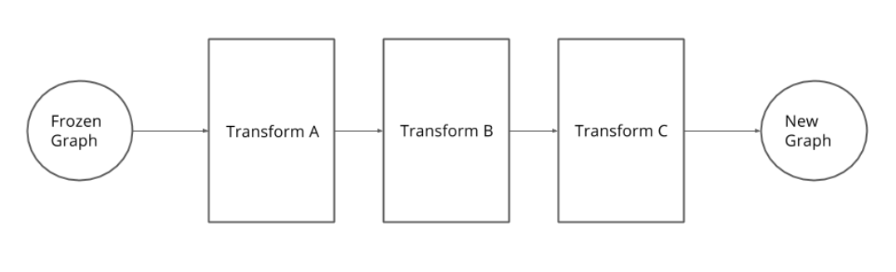

# 1. Introduction
 In this Repo, I am going to implement various optimizations such as fusion, quantization and machine code compilation to accelerate model prediction then I will walk through how to take advantage of these techniques in Tensorflow. 

The first question you might have is, "Why even bother? Are neural networks fast enough already?" . The answer depends on the application. If we were classifying whether something is a hotdog or not a hotdog, we'd be fine with out of the box inference speeds. 
But things like autonomous vehicles are more demanding than just identifying hotdogs. The perception system in the vehicle has to make predictions in real time. We can't use cloud computing resources due to the latency. So all of these predictions must take place on the vehicle computational hardware. Squeezing every last bit of performance out of the hardware is crucial. 

For example, semantic segmentation is computationally intensive. It's not uncommon for this pipeline to put out four to seven frame per second, while bounding boxes such as YOLO run at 40 to 90 FPS.

 
Semantic segmentation has advantages over bounding boxes obviously. But in its current state, the segmentation system is simply not fast enough. However, with various optimizations, we can increase the performance of this system by three to five times. I will cover fusion, quantization and graph to binary optimizations next. 

# 2. Freezing Graphs

Prior to applying any optimizations I will want to freeze the TensorFlow Graph such that it's self-contained in a single [protobuf](https://developers.google.com/protocol-buffers/) file. Freezing the graph is the process of converting TensorFlow variables into constants. During inference, variables become unnecessary since the values they store don’t change. I might as well convert them to constants, which the computer can work with faster.

Additional benefits of freezing the graph are:

* Unnecessary nodes related to training are removed
* The model can be contained entirely in one protobuf file (weights and graph definition)
* Simpler graph structure
* Easier to deploy (due to everything being in one file)

For these reasons, freezing the graph is commonly the first transform engineers execute when optimizing their network for inference. I I will use [the weights of a trained model](https://github.com/A2Amir/Inference-Performance-in-Tensorflow/blob/master/Code/Create_save_weights.ipynb) as the practical example but you can use the weights of your own model.

 ## 2.1. Freezing The Graph Tools
 Here are examples of the freeze graph tools:

* The original freeze_graph function provided by TF is installed in your bin dir and can be called directly if you used PIP to install TF. If  you can not find it please use **pip show tensorflow** to find the path, the tensorflow is installed then navigate to /python/tools or call is directly as below in jupyter notebook.

   ~~~python
   from tensorflow.python.tools.freeze_graph import freeze_graph
   ~~~
   
      ~/tensorflow/bazel-bin/tensorflow/python/tools/freeze_graph \

      --input_graph=base_graph.pb \
      --input_checkpoint=ckpt \
      --input_binary=true \
      --output_graph=frozen_graph.pb \
      --output_node_names=Softmax

  The freeze_graph function requires five inputs:
  
  *	The input graph input_graph saved in protobuf format.
  *	The input graph checkpoint, input_checkpoint.
  *	input_binary denotes whether the input graph is a binary file. Set this to true if the input is a .pb file instead of .pbtxt.
  *	The name of the output graph, output_graph, i.e. the frozen graph.
  *	The names of the output nodes. **It’s a good idea in general to name key nodes in the graph and these names will come in handy when using these tools as well.**
  
  The result is saved in the frozen_graph.pb file. 

 * I provide a slightly different version which is simpler and that I found handy. (see this [code](https://github.com/A2Amir/Inference-Performance-in-Tensorflow/blob/master/Code/freez_graph.ipynb)).

# 3. Using frozen Graphs

Once the graph is loaded I can access operations and tensors with the **get_operation_by_name and get_tensor_by_name tf.Graph** methods respectively. I could also retrieve all the operations with of a tf.Graph with the get_operations method, which is very useful if I am unsure which operation to use. The [load_graph method](https://github.com/A2Amir/Inference-Performance-in-Tensorflow/blob/master/Code/load_froozen_graph.ipynb) takes a binary protobuf file as input and returns the graph. When the graph is loaded I can take list of operations to make prediction. Check this exercise to get more familiar with using a binary protobuf file to make prediction.

# 4. Graph Transforms

A TensorFlow model is defined as a static graph through which data flows. Graphs are versatile data structures that can be mutated in various ways. TensorFlow takes advantage of this through graph transforms. A transform takes a graph as input, alters it, and returns a new graph as output. Note the original graph used as input is not mutated in place, so remains unaltered. A detailed discussion of many available transforms and how to apply them is found [here](https://github.com/tensorflow/tensorflow/tree/master/tensorflow/tools/graph_transforms/#introduction). While this information is not required for this lesson, it is worth a read to become familiar with the topic.

 
Several transforms can be chained together, typically this is done with a theme in mind. For example, I might want to reduce the graph size, optimize it for inference, create an 8-bit version of the graph, etc. In the following sections I will discuss two sequences of transforms:

1.	Optimizing for Inference

2.	Performing 8-bit Calculations

 ## 4.1. Optimizing for Inference
 
 ## Fusion

Before starting Optimizing for Inference you should have some Information about fusion. The fusion reduces the number of operations and accelerates the data passing through the graph. Consider a three layer pipeline (see gif below): batch normalization, feeding into a Relu, feeding into a convolution. 

The implementations above require each layer to store temporary tensors. I can fuse all three operations together and avoid storing all these extra tensors. Even better, the fuse operation only execute one kernel on the GPU instead of three. 

Each time a kernel is called, there is an overhead. Fusing kernels limits the overhead so the overall applications runs faster. Fusing saves both memory and time. 

Fusing could be beneficial in training as well as inference. The trade-off is that fusing reduces the flexibility of the network. During training, I might want to preserve the flexibility of the model in case I want to add or remove layers or transfer part of the network. By the time I get to inference, I am no longer changing the network architecture, so I can fuse operations more aggressively. 

It's important to know I could do fusing manually by coding up a single kernel that performs the three fuse operations together. However, the compiler is capable of doing this on its own, allowing me to write understandable code and still reap performance benefits. 
I can automate this process using an optimizer that will fuse common layers together. This allow me to write easier to understand code and manipulate it, while the final version after the optimization, will have all the performance advantages by applying tricks like fusion automatically. 
 
 ## Optimizing for Inference

Once the graph is frozen there are a variety of transformations that can be performed; dependent on what I wish to achieve. TensorFlow    has packaged up some inference optimizations in a tool aptly called optimize_for_inference.
 
 optimize_for_inference does the following:
 
 * Removes training-specific and debug-specific nodes
 * Fuses common operations
 * Removes entire sections of the graph that are never reached
 
 Here’s how it can be used:
 
     ~/tensorflow/bazel-bin/tensorflow/python/tools/optimize_for_inference \

    --input=frozen_graph.pb \
    --output=optimized_graph.pb \
    --frozen_graph=True \
    --input_names=image_input \
    --output_names=Softmax

I'll use the graph I just froze as the input graph. output is the name of the output graph; I’ll be creative and call it optimized_graph.pb. 

The optimize_for_inference tool works for both frozen and unfrozen graphs, so I have to specify whether the graph is already frozen or not with frozen_graph.

input_names and output_names are the names of the input and output nodes respectively. As the option names suggest, there can be more than one input or output node, separated by commas.

Let’s take a look at the other way to use  optimize for inference function in the jupyter note book. Check [this exercise](https://github.com/A2Amir/Inference-Performance-in-Tensorflow/blob/master/Code/OptimizingForInference.ipynb) to get more familiar with this function

 ## 4.2. Performing 8-bit Calculations
 
 Before performing 8-bit calculation you should know reducing Precision and Quantization Conversion.
 
 ## Reducing Precision

Neural networks are typically trained with single precision (32-bit floating point number). It has 23-bit significand that can do significant digits used in science disciplines. 

Double precision or 64-bit floats have 52 significant digits but turns out that level of precision is not needed in neural nets. So, most training is done in single precision. But it turns out we don't even need single precision for all the task, especially something like inferencing. 

 Using half precision or 16-bits with 11 significant at even lower positions, results in minimal changes in accuracy and does produce savings in time and memory. Essentially, I can increase the bandwidth to double with 16-bits compared to 32-bits. 

 
Note: Pushing precision to the limit is an active area of research. In fact, some results have been published only using one bit weights. The main issue when training neural network using lower precision is the effect on back propagation. The error caused by lower precision is amplified at each stage of the backward pass through the whole network. Backward passes only happen during training though. So, for inferencing this is a non issue and we can happily reduce precision. 

Typically, we convert floating point values to an 8 bit integer representation for 256 unique values. For example, zero to 255. This specific reduction in precision from floating points to integers introduces another type of optimization. The process of constraining values (see below) from a continuous range to a discrete range, is known as quantization. 

 
Using integers instead of floating points has the following advantages:
* Integer arithmetic can be faster than floating point arithmetic
* Low Memory Footprint
* More Arithmetic Throughput

## Quantization Conversion

There are a variety of ways to convert the floating point values to integers. The simplest is a linear conversion. A convenient characteristics of neural network weights is they inhibit a relatively small range. For example, in the  layer below, weights might range from -8 to 10. To perform a linear conversion we would assign -8 to 0, 1 to 128 and 10 to 255, and all the values in between accordingly. 

 
**Notice:** it's easy to convert back to a floating point number if it needs. 

## 8-bit Calculations

I have covered freezing the graph and optimizing for inference, but I haven’t yet covered quantization. So the next optimization I will discuss is converting the graph to perform 8-bit calculations. Here’s an example using the **transform_graph** tool:

    ~/tensorflow/bazel-bin/tensorflow/tools/graph_transforms/transform_graph \
    --in_graph=frozen_graph.pb \
    --out_graph=eightbit_graph.pb \
    --inputs=image_input \
    --outputs=Softmax \
    --transforms='
    add_default_attributes
    remove_nodes(op=Identity, op=CheckNumerics)
    fold_constants(ignore_errors=true)
    fold_batch_norms
    fold_old_batch_norms
    fuse_resize_and_conv
    quantize_weights
    quantize_nodes
    strip_unused_nodes
    sort_by_execution_order'

There’s a lot going on here, which you can find more information in the [TensorFlow Graph Transforms documentation](https://github.com/tensorflow/tensorflow/blob/master/tensorflow/tools/graph_transforms/README.md). The gist is that fold transforms look for subgraphs that always evaluate to the same result. Then they consolidate each such subgraph into one Constant node.

quantize_weights converts all the operations in the graph that have eight-bit quantized equivalents, and leaves the rest in floating point. It also adds nodes to convert back to floating point. The quantize_weights transform is mainly for reducing graph size. For the desired quantization computation behaviour we’ll need to use quantize_nodes as well.

The other way to use 8-bit Calculations function in the jupyter notebook. Check [this exercise](https://github.com/A2Amir/Inference-Performance-in-Tensorflow/blob/master/Code/8-bitCalculations.ipynb) to get more familiar with this function.

# 5. Compilation

Imagine I want to run the inference on a single image from the command line like below:

    python inference.py img1.jpg

inference.py is a Python program running inference on a TensorFlow graph.

Simplifying a little, the key steps are:
 
* The operating system starts a Python interpreter
* The interpreter runs the inference.py script
* TensorFlow runtime is started through the Python API.
* TensorFlow loads a saved model graph and weights.
* Start a TensorFlow Session.
* Perform inference on img1.jpg.
* Inference results are returned.

Notice most of the steps have nothing to do with the performing inference on img1.jpg. A possible improvement is to run a loop that performs inference once an image is received. This way we don’t start the interpreter, load the model, and setup the TensorFlow runtime for every image. The general idea is to reduce overhead as much as possible.

Imagine if, instead of loading Python and TensorFlow runtime, I just used a binary. A binary is an executable list of machine instructions. A binary doesn’t use the Python interpreter or TensorFlow runtime. It’s simply data in, Inference data out. The problem, of course, is that compiling the model down to a binary is very difficult. In fact, all of these optimizations are difficult to implement! Fortunately, many of these are already implemented for us by TensorFlow.

TensorFlow supports both JIT (just in time) and AOT (ahead of time) compilation. 

* AOT compilation is the kind used in a C or C++ program; it compiles the program “ahead” of the actual use. A really cool aspect of AOT compilation is you can potentially create a static binary file, meaning it’s entirely self contained. You can deploy it by simply downloading the file and executing it, without concern for downloading extra software, besides necessary hardware drivers, i.e. for GPU use.
* JIT compilation doesn’t compile code until it’s actually run. You can imagine as a piece of code is being interpreted machine instructions are concurrently generated. Nothing will change during the initial interpretation, the JIT might as well not exist. However, on the second and all future uses that piece of code will no longer be interpreted. Instead the compiled machine instructions will be used.

Under the hood AOT and JIT compilation make use of XLA (Accelerated Linear Algebra). XLA is a compiler and runtime for linear algebra. XLA takes a TensorFlow graph and uses [LLVM](http://llvm.org/) to generate machine code instructions. LLVM is itself a compiler which generates machine code from its IR (intermediate representation). So, in a nutshell:

    TensorFlow -> XLA -> LLVM IR -> Machine Code
    
which means TensorFlow can potentially be used on any architecture LLVM generates code for.
Both AOT and JIT compilation are experimental in TensorFlow. However, JIT compilation is fairly straightforward to apply. Note JIT compilation is NOT limited to inference but can be used during training as well.
~~~python
# Create a TensorFlow configuration object. This will be 
# passed as an argument to the session.
config = tf.ConfigProto()
# JIT level, this can be set to ON_1 or ON_2 
jit_level = tf.OptimizerOptions.ON_1
config.graph_options.optimizer_options.global_jit_level = jit_level
~~~
